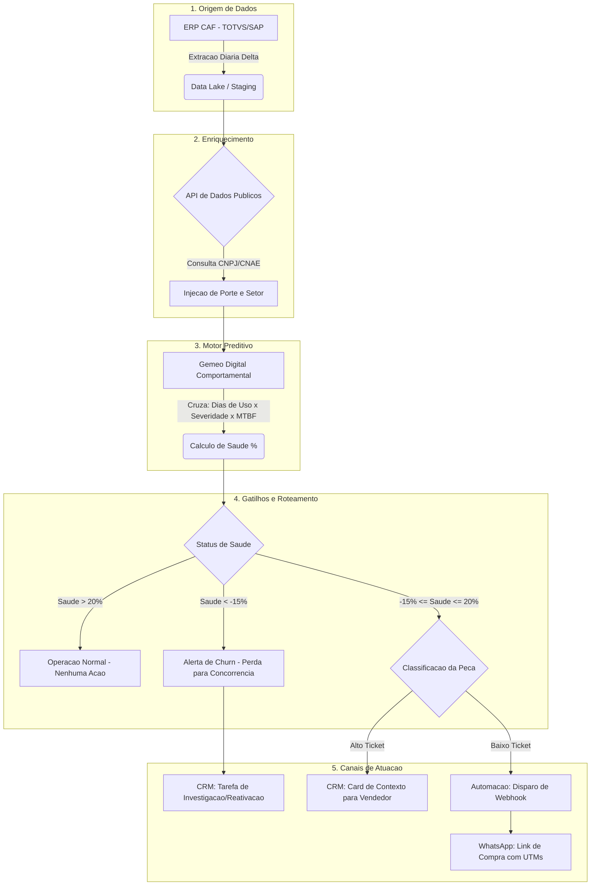

# Arquitetura e Fluxo de Dados: Sistema Preditivo CAF

Este documento detalha o fluxo operacional e a arquitetura de dados do sistema preditivo. O objetivo e fornecer uma visao clara de como os dados transitam desde a extracao no ERP ate a conversao em vendas preditivas.

## 1. Fluxograma da Arquitetura (Mermaid)

## 2. Detalhamento das Etapas

### 2.1. Origem de Dados e Extracao
A arquitetura inicia-se na base instalada da CAF. O sistema nao utiliza telemetria em tempo real (IoT), garantindo viabilidade e escalabilidade imediata para as 8.500 maquinas atuais sem custo de retrofit de hardware. A extracao ocorre em modelo "Delta", processando apenas as notas fiscais e ordens de servico das ultimas 24 horas, reduzindo o custo computacional.

### 2.2. Enriquecimento de Dados
Para compensar a falta de sensores, o sistema utiliza inteligencia de mercado. Atraves de consultas a APIs publicas via CNPJ, o sistema identifica o CNAE do cliente. Isso permite inferir a carga de trabalho do equipamento (Fator de Severidade). Por exemplo, um moedor em um supermercado de grande porte sofre desgaste muito maior que o mesmo modelo em um pequeno acougue de bairro.

### 2.3. O Motor Preditivo (Gemeo Digital Comportamental)
O core do sistema e o algoritmo de decaimento desenvolvido pela equipe. Ele simula o ciclo de vida da peca considerando:
* **Delta T:** Dias ativos desde a instalacao ou ultima troca.
* **Fator de Severidade (Sf):** Multiplicador baseado no setor.
* **Uso Diario (Ud):** Horas medias trabalhadas estimadas.
* **MTBF:** Tempo Medio Entre Falhas (Mean Time Between Failures) estipulado pela engenharia da CAF.

### 2.4. Roteamento Inteligente
A fim de respeitar a capacidade produtiva da equipe interna e otimizar o custo de aquisicao de clientes (CAC), o funil e dividido em tres caminhos logicos:
1. **Saudavel:** O ciclo de vida da peca esta normal. O sistema mantem o monitoramento silencioso.
2. **Risco Iminente (Troca Preditiva):** O desgaste atingiu a margem de risco. O sistema subtrai o Lead Time logistico da CAF (12 dias) e aciona os gatilhos antes da quebra da maquina.
3. **Abandono (Churn):** Se a peca ultrapassou drasticamente sua vida util teorica sem registro de compra na CAF, assume-se que ela quebrou e o cliente buscou uma peca paralela. Um alerta estrategico e gerado.

### 2.5. Canais de Atuacao
* **Baixo Ticket:** Pecas de desgaste natural e baixo valor agregado (como filtros e correias) nao justificam o custo da hora humana em ligacoes ativas. O sistema dispara automaticamente um webhook para plataformas de mensageria, enviando alertas preventivos pelo WhatsApp com links de compra rastreaveis para web analytics.
* **Alto Ticket:** Pecas caras e complexas geram um "Card de Contexto" no CRM. A equipe de consultores recebe a lista filtrada em ordem de criticidade, com o argumento de vendas pronto, maximizando a taxa de conversao para atingir a meta de faturamento de R$ 28 Milhoes.
